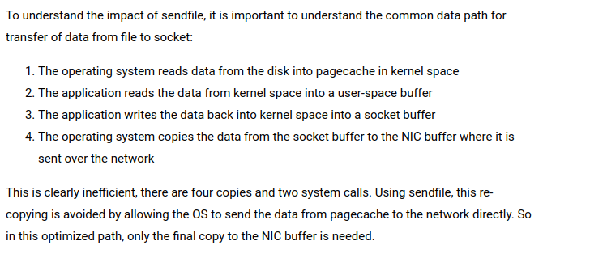

# Design
Kafka documentation is a masterclass on optimization
- data is written directly to fs instead of staying in memory -> leverage on pagecache provided by the os, collectively known as the message log
- uniform binary format of data -> can be send w/o modification -> optimization.
    - e.g. sending persistent log file with `sendfile` -> directly sending from fs (in pagecache) to a socket (os feature)

